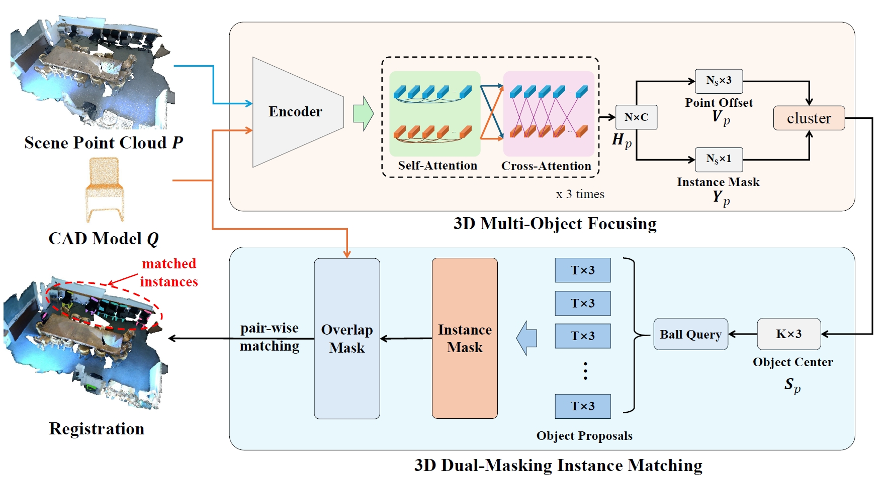

# 3D Focusing-and-Matching Network for Multi-Instance Point Cloud Registration

Pytorch implementation of the paper:
[3D Focusing-and-Matching Network for Multi-Instance Point Cloud Registration](https://arxiv.org/pdf/2411.07740).

Liyuan Zhang, Le Hui, Qi Liu, Bo Li, and Yuchao Dai.

Email: zhangliyuannpu@mail.nwpu.edu.cn

## Introduction
Multi-instance point cloud registration aims to estimate the pose of all instances of a model point cloud in the whole scene. Existing methods all adopt the strategy of first obtaining the global correspondence and then clustering to obtain the pose of each instance. However, due to the cluttered and occluded objects in the scene, it is difficult to obtain an accurate correspondence between the model point cloud and all instances in the scene. To this end, we propose a simple yet powerful 3D focusing-and-matching network for multi-instance point cloud registration by learning the multiple pair-wise point cloud registration. Specifically, we first present a 3D multi-object focusing module to locate the center of each object and generate object proposals. By using self-attention and cross-attention to associate the model point cloud with structurally similar objects, we can locate potential matching instances by regressing object centers. Then, we propose a 3D dualmasking instance matching module to estimate the pose between the model point cloud and each object proposal. It performs instance mask and overlap mask masks to accurately predict the pair-wise correspondence. Extensive experiments on two public benchmarks, Scan2CAD and ROBI, show that our method achieves a new state-of-the-art performance on the multi-instance point cloud registration task.



## Installation

3DFMNet is tested on Python 3.7, GeForce RTX 4090, install 3DFMNet with the following command:

```
# It is recommended to create a new environment
conda create -n 3DFMNet python==3.7
conda activate 3DFMNet
# Install packages and other dependencies
pip install -r requirements.txt
python setup.py build develop
```

## Data preparation
You need to pre-download dataset on [ROBI](https://www.trailab.utias.utoronto.ca/robi). ROBI data organization will be as follows:
```
ROBI/
|--Chrome_screw/
    |--Scene_1/
        |--...
    |--...
|--DIN_connector/
    |--...
|--...
```

## Training
Due to the limitaion of device memory, we train the two-stage model separately.
As for 3D Multi-Object Focusing Network, you can use the following command for training.
```
cd scripts
sh robiFocus_trainval.sh
```

After that, we generate the ground truth center-based neighbord for training and the train the 3D Dual-Masking Instance Matching Network, just as the following:
```
cd scripts
python make_proposals.py
sh robiMatch_trainval.sh
```

## Testing
To test the performance of the 3D Multi-Object Focusing Network, you can use the following command:
```
sh robiFocus_test.sh
```
The results recall and precision reveal the performance of the focusing network. Noted that it is not the final result!

As for 3D Dual-Masking Instance Matching Network, we will generate the object proposal and use it for matching.
```
cd scripts
python make_proposals.py
sh robiMatch_test.sh
```
We provide our pretrained weights in [robi_ckpts]() and the object proposal we generate in [robi_proposal]()

## Acknowledgements
Our code refers to [MIRETR](https://github.com/zhiyuanYU134/MIRETR). Many thanks to MIRETR for a great work.

